# AI代码编辑工具使用培训材料

---

## 1. 我们的背景与解决方案：拥抱AI研发能力

### 1.1 研发效能新基建
在 2024-2026 年，AI 辅助编程已经从早期的“新奇玩具”快速演化为**全产研团队的标准生产力设施**。今天，面对越发复杂的业务与系统架构，单靠单纯的文本堆砌已经难以满足激增的开发效率诉求。在这个大背景下，我们不仅需要拥抱 AI，还需要以组织的形式系统化地引入强大的工具库。

### 1.2 公司的 AI 模型网关服务：CliRelay
为了将强大的大模型能力合规、高效地引入团队，我们研发并开源了专属的模型网关服务 —— **CliRelay**。
- **开源地址**：[https://github.com/kittors/CliRelay](https://github.com/kittors/CliRelay)
- **核心业务价值**：
  - **集中化权限控制**：方便安全地分发 API Key 给多位同事甚至跨部门团队，无需所有人都持有平台根账号。
  - **灵活共享机制**：支持统一的限流、大模型账号共享与额度管控。
- **赋能团队的 AGENT 项目开发**：
  除了作为代码辅助客户端的节点，CliRelay 也为公司内置或定制的 Agent 项目开发提供了极大的支持，**主要体现在支持原生的三种主流大模型 API 格式调用**：
  1. **OpenAI 兼容格式**：兼容性霸主，适用于市面上绝大部分的开源前端及应用开发框架（如 LangChain）。只需更换 URL 即可平滑切换底层通用模型资源。
  2. **Anthropic 原生格式**：完美兼容其原有的 Messages 及强劲的 Tool Use（工具调用） 特性，可以无损还原类似 Claude Code 所需要的复杂任务调度上下文。
  3. **Google Gemini (及其他) 原生形态**：提供特定语法的平滑代理支持，让跨平台的复杂 Agent 切换如同本地一般顺畅。

此外，基于该网关系统的深层可观测性，**我们能将 Agent 的上下文进行极其细致的展示，这极大地避免了之前开发 Agent 时经常遭遇的“黑盒感”**（即开发者经常不知道模型实际上拼接了什么隐性 Prompt 或调用了何种工具的困境）。这种对多轮对话及工作流调用状态的透视与回溯，是我们网关平台对开发者赋能的巨大优势：

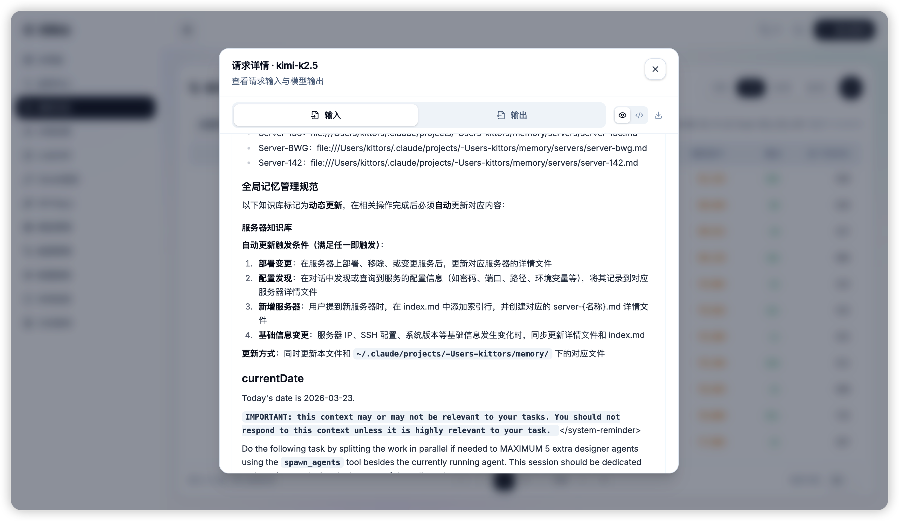

---

## 2. 为什么推荐大家使用 Claude Code 与 Codex？

市面上的代码辅助工具层出不穷（如基于网页交互的 ChatGPT，以及重型的 IDE 插件工具），既然如此，为什么我们**强烈推荐在工程实战中将 Claude Code 与 Codex 作为第一梯队列装**呢？

除开它们作为纯正 CLI 工具能够“原生执行终端命令、直接免复制粘贴改写文件”之外，更具根本战略原因的优势在于：

**1. 出自全球顶尖 AI 厂商的官方嫡系产品**
- Claude Code 与 Codex 分别是当今全球最顶尖的底层大模型公司 **Anthropic** 和 **OpenAI** 官方倾力主导研发的旗舰级终端客户端。
- **更新效率极高，拥抱最新代理技术**：由于是“亲生”应用，它们在迭代速度上有着套壳应用无可比拟的优势。一旦底层的大语言模型（如 Claude 3.7 或 o3）推出新的能力接口，这两款工具总能第一时间首发并调优使用体验，始终引领业界趋势。

**2. 繁荣的生态与开源社区沉淀**
- 它们背后不仅站立着顶尖的公司，更维系着地球上最活跃的 AI 极客开源圈子。无论是社区产出的层出不穷的 `Skill` 工作流配置，还是爆炸式增长的各种可插拔 MCP 服务，你遇到的开发痛点在这里往往能最快找到成型的最佳实践，并与全球的先锋架构师同步交流。

**3. 开阔护城河视野，启发团队打磨自有 Agent 项目**
- 引入这二者，不仅仅是为了日常敲代码快一点。这两款产品代表着当今世界最前沿、最领先的 **Agentic（代理化、自主任务智能体）技术** 落地标杆。
- 当团队在日常深度运用这些顶级 Agent 进行多轮调度和拆解任务时，开发者将能以最直观的方式观察到它们背后的上下文推理链以及状态管理逻辑。这将直接、有效地反哺和**激发我们在探索与研发公司内部 Agent 业务模块时的产品设计思考与思路跃迁**。

### 2.1 巅峰对决：Claude Code 与 Codex 的性格差异与能力边界
虽然它们同为业界顶流的神兵，但底层预训练基因决定了它们在实际干活时展现出了截然不同的“脾气”。在你准备调动它们前，请一定要熟读这套**血泪避坑实录**：

**1. Codex (CLI)：纪律严明且带着“道德洁癖”的死士特工**：
- **致命长板**：作为 OpenAI 矩阵下的产物，Codex 的**工程执行能力极其彪悍**，对常规工程指令有着机械般的无条件服从。只要给它定下死目标（例如部署某服务），它就会立刻调动组件去跑流程绝不偷懒。
- **💥 致命弱点 (一)：死胡同兜底**：正因为过于执着，它极度喜欢“自己解决所有报错”。当遇到无法跑通的顽固环境错漏时，很容易一根筋地去反复试错修补，极易在屏幕前陷入自我纠缠的**“死循环”**，白白把时间跑死。
- **💥 致命弱点 (二)：过度道德感**：带着极其严苛的安全雷达。它对于**爬虫抓取、数据逆向工程、渗透脚本**甚至仅仅是敏感的隐私参数，常常爆发毫无必要的“道德拒答”。这会让极客开发寸步难行。

**2. Claude Code：发散思维的“百无禁忌”架构师**：
- **致命长板 (一)：算法拔尖**：背靠目前推理巅峰的 Claude 模型，它天然具备**极强的复合算法分析能力与宏观发散思维**。哪怕是抛给它乱成一团麻的海量老旧源码，要求拆分纠缠架构，它也总能四两拨千斤。
- **致命长板 (二)：没有道德包袱**：对比上面那位，它在极客任务中更像个来者不拒的实用主义者。没有繁文缛节的安全阻断，只要你敢提，不管是写复杂的网页爬虫协议还是深度的逆向数据提取，它全部手拿把掐照写不误。
- **💥 致命弱点：长时幻觉**：极其聪明带来的反噬是容易“梦游”。在进行跨度极大或持续数十轮交互以上的高负荷流水线期，容易发生记忆流失、自我脑补设定未经验证的冗余架构的**“重度幻觉”**。

**所以到底该用谁？全栈选型备忘录：**
| 工具类型 | 司令官你的首选挂载场景 | 统帅避坑原则与对策 |
|---------|-----------|------------|
| **Claude Code** | 需要极强的心智去进行**复杂算法拆解**；或者**执行逆向、全站爬虫等易触发别家平台审查的灰色工程任务**。 | **防梦游**：严禁无脑挂机单一主线去长时迭代大架构。发现它自我闭环时，立马重置。 |
| **Codex (CLI)** | 已经有清查好的清白逻辑！要求一个毫无大模型包袱的工兵去极致且极快地**物理落实那些大规模杂碎代码重构**。 | **防死缠**：绝不要让它陷入未知的报错海洋，一旦发现在同一个报错里循环尝试 3 轮，断然强杀进程！ |

**核心共性**：**“基于 Terminal（命令行）原生的能力”才是最高效的沟通手段**。因为 AI 能在自己的工作目录下直接看见你报错的依赖、追踪编译历史，使得这二者无论谁出马，都能让交流实现真正的“零障碍透视”。

---

## 3. 核心驱动概念解析：MCP 与 Skill 的进阶指北

在使用 Claude Code 等强力终端助手时，有两个不可或缺的核心概念你必须掌握：**MCP** 与 **Skill**。这两者构成了我们自动化编程的任督二脉。

### 3.1 什么是 MCP，为什么建议“拿来主义”？

- **定义**：模型上下文协议 (Model Context Protocol)，你可以把它想象成赋予 AI 具体能力的 **“USB-C 扩展接口”**。
- **为什么我们只建议使用市面上成熟的 MCP，而不推荐去重写开发？**
  - MCP 属于底层通讯基建代码，自己手写不仅调试成本极高，而且一旦宿主环境更新极易损坏失修。
  - 如今的开源社区与生态已经极其繁荣，**绝大部分你能想到的场景都有成熟的开源框架与标准 API 封装可免费调用。更聪明的方式是拿来即用**。

**大家常用的第一梯队 MCP 列举：**
- **context7 mcp**：用于极致增强大型项目特定语境上下文感知与片段检索方案的核心辅助。
- **playwright / puppeteer**：自动化测试不可或缺的利器，允许终端 Agent 帮你主动唤起并操作浏览器进行验收录制。
- **github**：打通代码库隔阂，允许大模型在编辑完成时亲自拉取日志、处理 Issue 并提交 PR。
- **figma**：穿透设计稿底层结构，提取设计图的样式参数转换为可用变量。
- **pencil mcp**：极速原型的神兵利器！只需向 AI 描述产品的表述，它会连接绘图指令瞬间为你画出带有逻辑结构的页面线框草图，完全实现“草图即原码”。

#### 3.1.1 MCP 的配置与极其简单的安装方式

**1. 最直接（也最推荐）的安装方式：直接吩咐**
在 Claude Code 或者 Codex 的终端窗口中，最高效的方式是对其直接下达自然语言 Prompt。
- **安装用例**：你在终端输入 *"帮我安装 github mcp"* 或 *"帮我把 context7 mcp 配置接入当前环境，如果没有请自动下载"*。
这两款业界顶级的客户端会自己利用系统的包管理器，**“自己给自己自动完成资源拉取、侦测安装和文件修改”**，完全无需人类插手。

**2. 手动配置位置与说明**：
即便你可以让它全自动处理，你也需要知道配置在哪里以便于排错：
- **配置文件物理挂载点**：在这两款顶级工具中，由于 MCP 承担着提供全局底座服务能力的职责，它们需要被精确地注册在主配置文件中。
  - **Claude Code的挂载点**：它的外接能力全权登记在电脑独立 JSON 配置表中：`~/.claude/mcp.json`。
    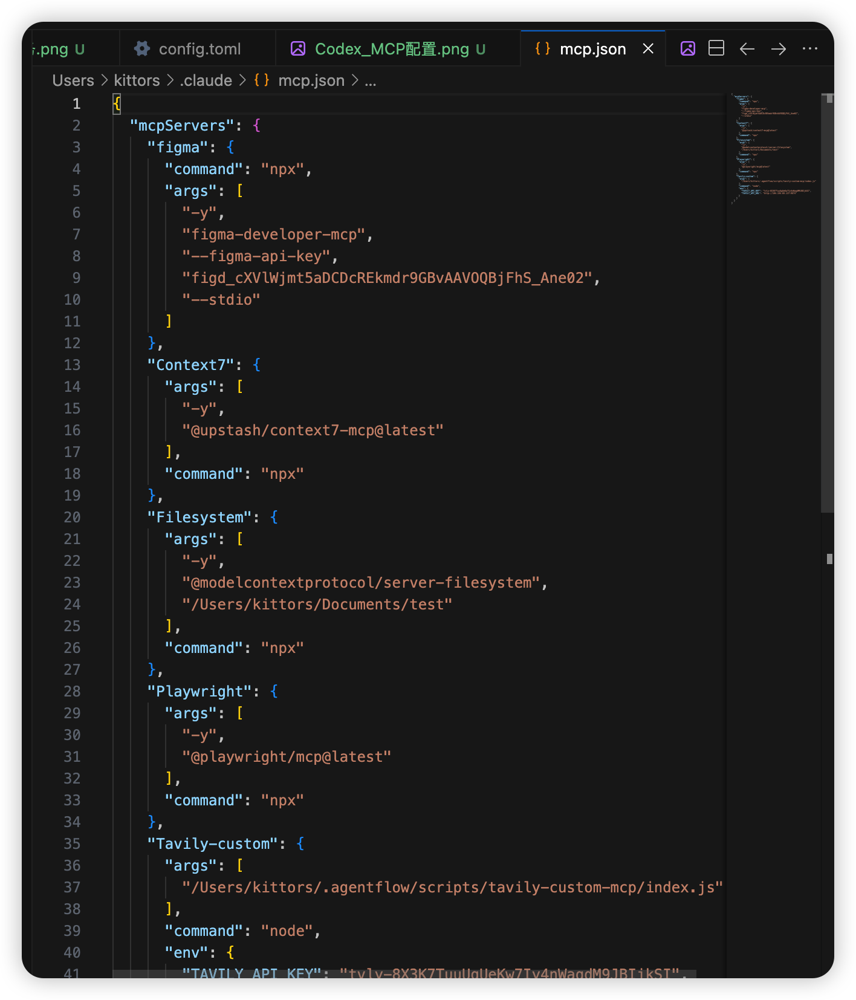
  - **Codex CLI的挂载点**：而对于大融合终端 Codex 而言，它所有的第三方服务扩展规则往往收敛于其主轴配置文件：`~/.codex/config.toml` 之内。
    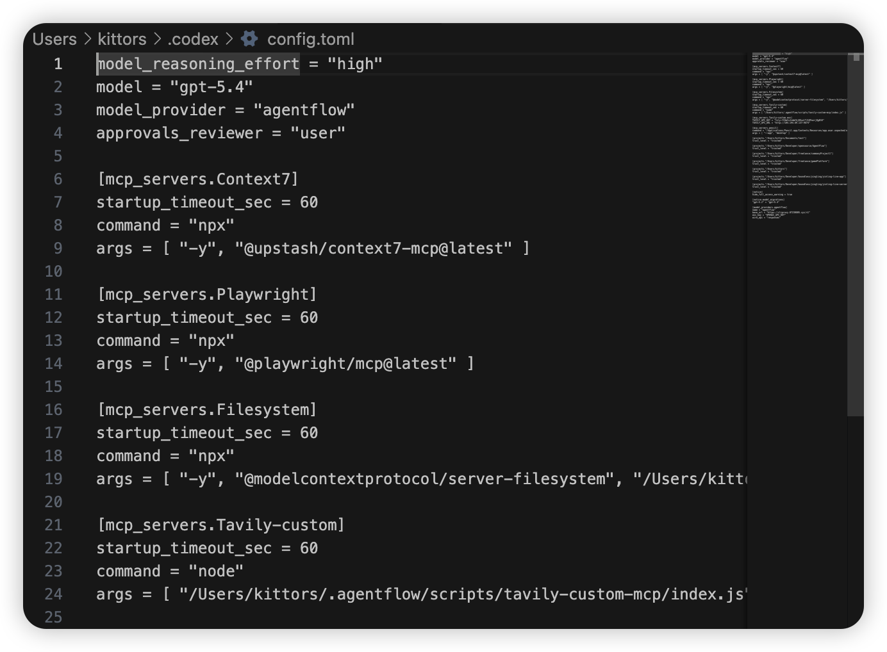

---

### 3.2 什么是 Skill？它才是沉淀团队资产的大脑

- **如果说 MCP 只是提供机械执行的“手、脚”，那么 Skill（技能）则是类似于 `SKILL.md` 文档内定义的工作流 SOP 与定制验证逻辑，可以说是 AI 的工作大脑。**
- **为什么强烈推荐大家大力创建专属的 Skill？**：相比写冷冰冰的 MCP 代码，写 Skill 的门槛极低，回报极高！你只需要在文件中利用自然语言告诉大模型：“当遇到 Vue 文件时，你必须使用特定的组件库，并且必须写完某个测试。”，它就能按部就班成为某项业务的专家。

#### 3.2.1 让人称奇的快速创建体验

在先进的终端助手里创建这类规则体系，已进化到了一句话即可。

- **在 Claude Code 中一键生成：**
  例如，当你想要创建一个能自动检索并处理网络内容的专属技能时，你只需抛出你的查询意图，并直接吩咐它：“帮我创建一个 Skill，用来查询互联网数据并进行汇总”，它便能迅速领会并为你封装好整套工作流：
  

- **在 Codex 中高效组合：**
  Codex 则更具备专有特色，提供了诸如专门的 Skill Creator 流水线交互程序来创建技能：
  

#### 3.2.2 意图分析与无感调用：为什么专属 Skill 更高效？

当你在项目中设定了专属的 Skill 后，最震撼的体验在于：**Agent 会根据你的对话意图自主分析，极其自然地优先调配你的专属 Skill。**
举个实战案例：当你向系统注册了经过针对性优化的互联网搜索 Skill 后，每当你提问“帮我查询下最新的 AI 相关的新闻”时，它**不再走缓慢且冗余的预设系统工具（如 `web_search`）**，而是极其聪明地拦截意图并交由你的专属 Search Skill 执行。速度更快、定制化汇总效率更高。

以下是实际调用时，Agent 自主拦截并执行我们量身定做的 Search Skill 的透视情况：
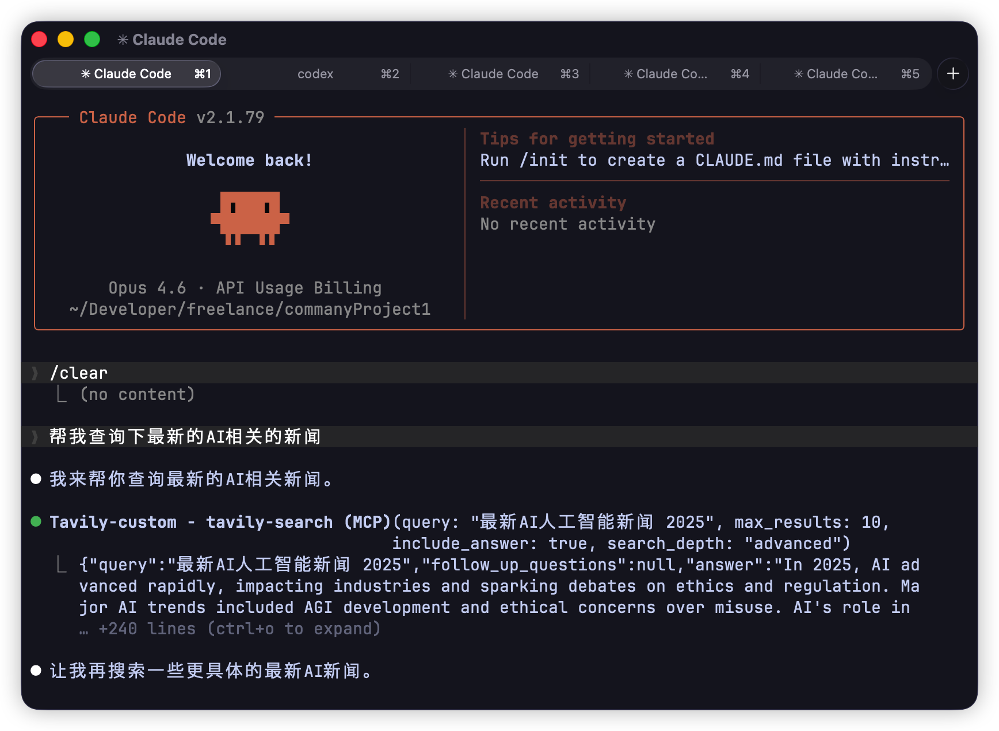

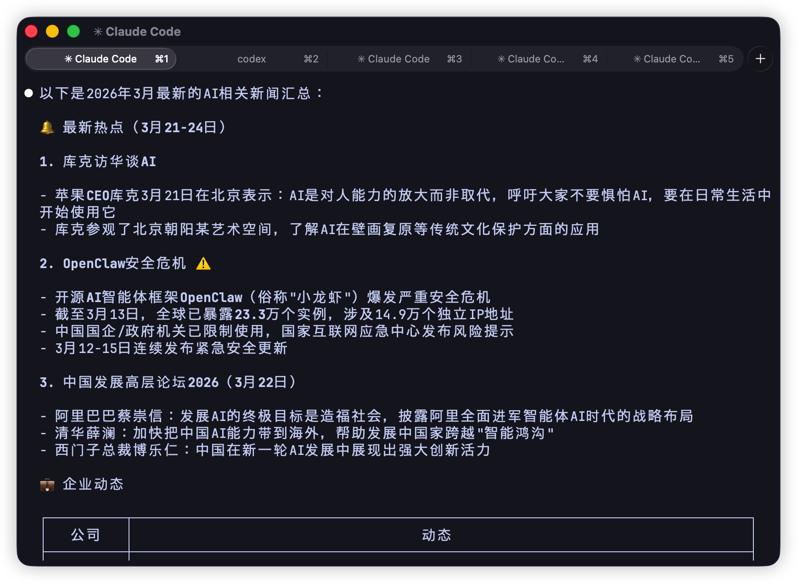

---

### 3.3 进阶原理：Skill 与 Commands 的双端目录树结构解析

要想不搞混淆，你必须理解特定的 AI 能力是如何被隔离加载的。目前业界顶级 CLI 工具采用了标准化的**目录树架构**来管理这些配置资产。
> 🚨**特别提醒**：对于 Claude Code 来说，官方在设计上隔离了两个概念：
> 1. `Commands`：存放在 `commands/` 目录下的孤立单体 `.md` 提词板文件，偏向轻量调用和指令模板。
> 2. `Skills`：存放在 `skills/` 目录下的工程化资源。每一个 Skill 必须独占一个专门的文件夹，并以解析 `SKILL.md`（带YAML头）作为该资源的主入口文件。

**1. 项目级别设定（跟随仓库流转的专有规范）**
- **核心定位**：必须放入项目 Git 控制下随代码流转。这能确保团队克隆该工程的任何人在使用 Agent 时将被强制匹配这些业务规则。
- **配置结构实例**：

  ```text
  [你的工作区] 例如 MyWebApp/
  ├── src/                # 你的常规业务代码区
  ├── .claude/            # [目前官方主推的 Claude Code 项目层控制区]
  │   ├── commands/       # 【轻量指令区】：直接放入单文件 .md（如 /check-audit 请求执行审查）
  │   └── skills/         # 【重型能力区】：每一个技能必须是独立文件夹结构！
  │       └── search-tool/# 这个名字就是挂载技能的包名
  │           └── SKILL.md# 包含 YAML 前缀和逻辑说明必须叫 SKILL.md
  ├── .codex/             # [Codex CLI 隔离配置专用区]
  │   ├── AGENTS.md       # 声明该项目的宏观系统提示词约束基石
  │   └── skills/         # 项目级 Codex 技能包存放目录
  │       └── generate-ui-spec/
  │           └── SKILL.md
  └── .gitignore          # （确保把 .claude 或 .codex 包含的技能从忽略栈剔除）
  ```

**2. 全局级别设定（伴随自身账户的主干大脑）**
- **核心定位**：保存在你自己用来打代码的笔记本电脑总管层里。无论你去写哪一个项目，这组属于这台设备的系统级习惯都会陪伴左右执行。
- **配置结构实例**：
  此类全局大设定往往藏在 Mac 系统对应的家目录（Home Directory）之下。

  ```text
  [你的用户根目录] 例如 ~/. 或是 /Users/kittors/
  ├── .claude/            # 全局 Claude Code 系统基础挂载点
  │   ├── mcp.json        # 前面指引配置的全局系统 MCP 清单
  │   ├── commands/       # 全局跨项目通用的个人单文件 .md 快捷指令 
  │   └── skills/         # 全局通用 Claude 重度技能库
  │       └── global-style-checker/
  │           ├── scripts/
  │           └── SKILL.md
  ├── .codex/             # 全局 Codex 系统首选项目录
  │   ├── config.toml 
  │   ├── AGENTS.md       # 全局强行约束个人基础指令提示框架
  │   └── skills/         # 全局通用 Codex 技能实体目录
  │       └── personal-helper/
  │           └── SKILL.md
  ```

这套结构区分出 `Commands` 与伴生复杂脚本资源的专用 `SKILL.md`，使得我们组织 Agent 的团队开发能力变得有理有据。


### 3.4 生态福利：Vercel Skills Hub 与一键安装神器

你可能会问：既然 Skill 这么好用，难道每次针对常见的规范或操作，都要自己手写一遍长长的 YAML 和 Markdown 吗？
并不！Vercel Labs 已经牵头打造了一个繁荣的 **开源 Agent 技能包生态与包管理体系**，其愿景就是做 AI 工具里的 NPM。业界涌现了如 `skills.sh` 这样发现和索引优秀开源技能的公共平台。

Vercel 直接提供了一套叫 **Vercel Skills CLI** 的执行器。它最绝妙的地方在于：它能自动探测你当下的开发环境，并根据你正在使用的是 Claude 还是 Codex，自动把云端打包好的技能源源不断地下发并**挂载注册**到你本地正确的私有目录（如 `.claude/skills/`）中。

**极简的获取指令：局部注入 vs 全局挂载**
新生态已经完全废弃了繁琐的手工克隆与复制粘贴。更绝妙的是，这个 CLI 严格遵循了我们在 **3.3节** 讲到的隔离法则，它会智能精准地为您存放技能资产：

- **默认注入项目级能力（局部管控，跟随 Git 流转）**：
  直接在需要赋能的单个项目根目录运行安装命令。例如：
  `npx skills add vercel-labs/agent-skills`
  如果不加任何多余参数，它的默认行为就是“项目级”。Vercel 工具会自动探测终端所处的工程，并在你当前仓库的 `.claude/skills/` 或 `.codex/skills/` 等私有结构内安放它，确保只有改该仓库的同学能享用。

- **注入全局大脑（本机跨项目随时支援）**：
  如果您在 `skills.sh` 搜寻到了一个极其顺手的通用基建插件（例如统一代码 Review 专员），并且想跨越所有的代码库、随时随地都能呼唤它，您只需额外附带一个 `-g`（global）标示符：
  例如执行：`npx skills add tenfyzhong/skill-hub -s "analyse-issue" -g`
  这行携带了 `-g` 灵魂参数的指令，将会霸气地绕过当前具体项目，直接将技能文件群解压注入到你 Mac/PC 的系统家目录底层（例如 `~/.claude/skills/`）中。从此以后不管终端切到了哪，这套绝技始终与你如影随形！

**如何查询与发现好用的开源技能？**
既然这是 AI 界的 NPM，你同样拥有多种查阅库的方式：
1. **纯命令行极客查找**：直接在终端输入 `npx skills find [关键词]`（例如对架构感兴趣就输入 `npx skills find architecture`），Vercel 就会给你列出所有相关源清单并允许你交互式安装。如果想查看自己已经安装了什么，可以随时敲入 `npx skills list`。
2. **逛云端可视化大厅**：如果不明确自己需要什么，你可以前往开源极客社区们搭建的 **skills.sh**。这里就像是大模型的 App Store。看中了哪个神级 Prompt，点击网页按钮一键复制它的 `npx skills add` 代码丢进本地即可！

通过这个入口，你能源源不断地白嫖吸收全球顶级开发者的代码调教经验与 Workflow！

---

## 4. 双端核心进阶：Claude Code 与 Codex 实战技巧详解

为了让你和团队能立刻在新克隆的项目工作区（Workspace）中用起来并成为高阶玩家，以下是我们整理的双端核心实战教程。在这之前，**所有的终端对话式 Agent（如 Claude Code 和 Codex）都继承了 Unix 标准的快捷健位池**。掌握这些能让你在下达神级口令时快人一步：

| 极客常用快捷键 | 终端交互台（CLI）效果展示 |
| --- | --- |
| `Ctrl + U` | **删除全部内容（向长清空）**：当你发现写了一长串需求想要全部推倒，一键秒删当前光标到行首的所有字符。 |
| `Ctrl + K` | **向后清理字符**：精准抹除当前光标向右（向后）的所有残留废弃文本。 |
| `Ctrl + W` | **向前精切删词**：最常用的悔棋键，一键打掉刚敲错的完整英文单词。 |
| `Ctrl + L` | **霸气清屏**：遇到终端由于大模型推演导致被旧信息挤满时，立刻把界面清零重焕整洁视野。 |
| `Ctrl + A` / `Ctrl + E` | 飞速定位指令：一键跳至行首 (`A`) / 一键跳至行尾 (`E`)。 |

掌握以上心法后，我们将从内部大模型的**基础唤醒指令**起步，到注入深层开发记忆，再到当下业界最火热的**并行 Subagent** 进行全面拆解。

### 4.0 核心共性制胜法宝：/plan 模式（防跑偏神器）

在深入各端专属技巧前，必须重点介绍一个双端共通、且能拯救你无数代码灾难的神级指令：`/plan`。

无论是 Claude Code 还是 Codex，在面对复杂需求时，大模型最容易犯的通病是“边想边写”。这往往会导致它们写到一半发现架构冲突，从而陷入无尽的反复自我修改和死循环。`/plan` 模式正是为了打破这种困境而生的。

**用法与核心价值**：
在对话框中键入 `/plan` 加上你的需求（例如：`/plan 重构用户登录模块，改为 JWT 鉴权`），大模型将**绝对不会立刻动笔改代码**，而是会进入“谋定而后动”的纯正架构师状态：
1. 扫视与梳理现有项目的上下文
2. 拆解详细的任务流水步骤（Step 1, Step 2...）
3. 明确列出即将需要修改或创建的文件清单

> 🚨 **高危防坑警告**：
> **如果你的任务预估步骤超过 3 步，强烈建议一定要使用 `/plan` 开始任务！**
> 并且在 AI 输出计划清单后，**人类统帅必须非常详细地阅读这份计划**。只有在你审查并确认它的拆解思路完全符合你的系统设计预期后，再允许它开始执行。这是防止大模型出现严重“代码幻觉”和“需求跑偏”的最后、也是最有力的一道防线！

### 4.1 Claude Code 核心实战技巧

#### 4.1.1 基础控制与内置斜杠 (`/`) 指令大全
进入 `claude` 的实时交互态后，它内置了一套原生只认斜杠的高级控制操作台，你可以把它当做驾驭引擎的中控。我们从官方名录中精选了日常实战中最常用、最具极客属性的几大司令：

| 官方真实高频 `/` 指令 | 核心极简说明与运用场域 |
| --- | --- |
| `/plan` | **谋定而后动**：遇到复杂需求时，先让大模型梳理上下文并出具详细的实施步骤清单，人工审查无误后再批准动工，是防患于未然的起手式。 |
| `/clear` | **终局洗牌**：完全清空当前对话历史记忆。这是跑偏或者**防止对话太长而白烧大额 Token** 时的最硬生杀权。 |
| `/compact` | **内存柔性压缩**：比一刀切的 `/clear` 更温和，只清除冗长对白，但会极其聪明地浓缩保留一份结构化摘要（Summary）在脑海里。 |
| `/btw` | **侧线平行侦查（By the way）**：神级指令！在主线调试没断时，用它插入问个毫不相干的快打问题（如`/btw 这个类的原作者是谁`），主线推演完全不会被打断或影响。 |
| `/resume` | **复活历史脑图**：随时接回之前的废弃或遗留战局（对话）。**（注：此令仅对当前所在的 Workspace 工作目录生效，实现了不同业务上下文记录的物理隔离，绝不串台！）** |
| `/context` | **可视化内存雷达**：一键以彩色网格（Colored Grid）的视觉矩阵，向你呈现此时已经消耗了多少 Context Window 的负载。 |
| `/mcp` & `/memory` | **装备包挂载查验**：用于现场检查所有外接服务（如上文物讲的 Pencil MCP）是否绿灯，以及统读对当前库的所有层叠记忆。 |
> （其他如 `/pr` 一键推入 GitHub，`/login` 等更多辅助口令可直接按 `/help` 自取查阅。）

**极其重要的高能技巧：终端外置如何极速调取可视化历史？**
很多时候昨晚推演到一半的模型上下文，我们一定不希望它被淹没。除了在内部调用恢复之外，当你在完全退出交互界面的情况下，也可以依托于极简的外部启动项选取器（Interactive Picker）光速召回：
- **查阅可视化历史雷达**：当你在终端敲击 `claude -r` （或 `--resume`）启动时，系统会弹出一个极为华丽的**交互式可视化选择面板（UI）**，里面详列了你**当前所在项目目录**下的每一场对话快照。甚至你能像骇客一样加缀搜索词（如 `claude -r "bugfix"`），从无数次旧档里瞬间挑出那场光辉战绩紧密地接续推演！

**⚠️ 护肝小绝招：如何斩断烦人的 `Accept` 铁链去实现长时挂机？**
很多新手刚用 Claude Code 跑复杂的大型重构及自动化批量工作时都会崩溃：只要稍微涉猎到修改文件或运行系统底层命令行，它仿佛挤牙膏一样，反复跳出需要审批过坎的 `[Accept?]` 红字弹窗让你按 `Y` 去签发确认权！这导致整个流水线寸步难行，更别提离开座位去“挂机”。
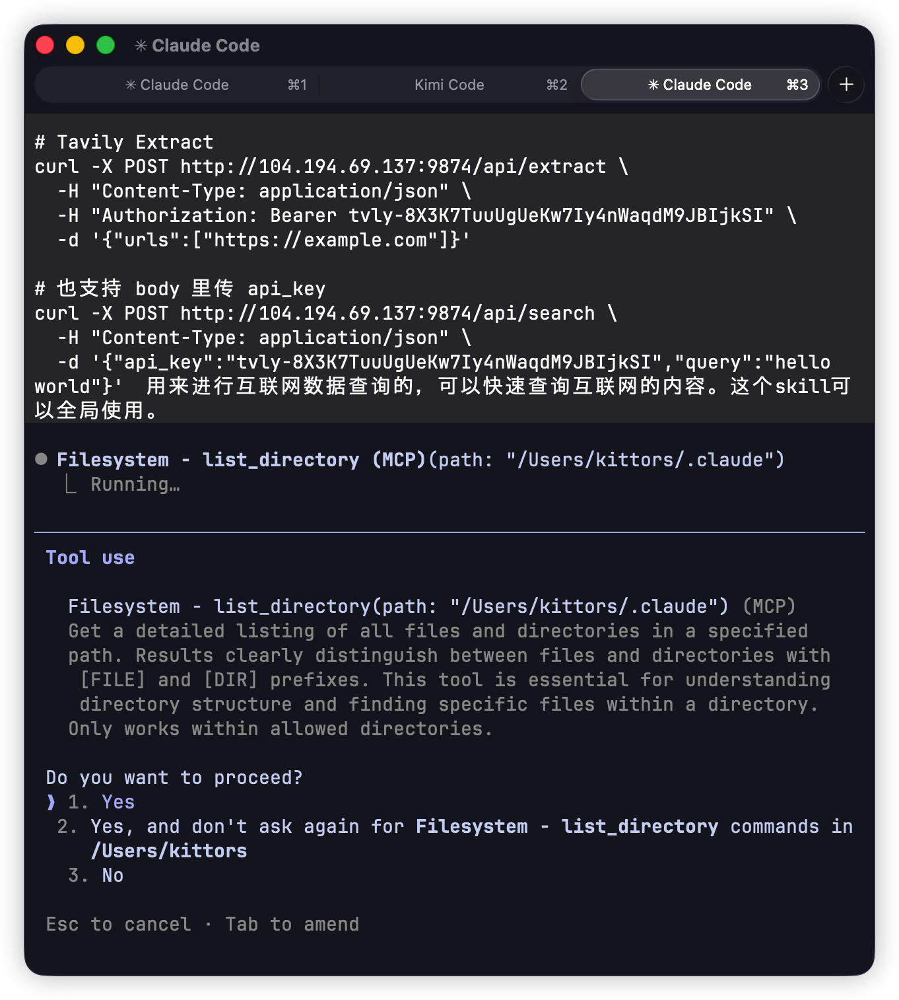
**终极破解之法**：在准备发动这种大范围修补的战役启动时，直接在终端祭出这句霸王条款（黑魔法）：
```bash
claude --dangerously-skip-permissions
```
进入这个“法外狂徒模式”后，它将不再做任何过问和挽留，全程静默碾压执行。但这把双刃剑请只用在你绝对信任的沙盒或是完全吃透了的代码库上！

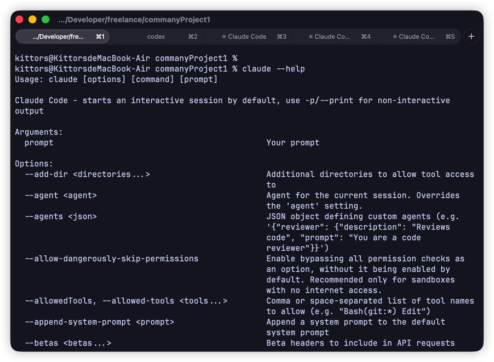

#### 4.1.2 拒绝健忘，帮 Agent 搭建长时记忆系统
由于模型的每次阅读 Token 是昂贵且有限的，我们需要一套外部大脑方案。在 Claude 中，一切记忆持久化的核心在于 **`CLAUDE.md`**。

**实操步骤：极速构建你工作区（Workspace）的专属架构大脑**
1. **进入工作区**：打开终端并跳转 `cd /Users/你的名字/Projects/YourProject`，启动 `claude`。
2. **侦测并生成基石记忆**：向它输入 `/init` 或者使用命令让其分析全库，Claude Code 将自动阅读整个源码及其配置，并在你项目的根目录下为你生成一份 `./CLAUDE.md` 知识沉淀文档。
3. **编辑你的个性化“军规”**：打开新生成的 `./CLAUDE.md`，你可以在此写入强制大纲：“*后端统一使用 SpringBoot 3，数据库查询必须包含防止并发的锁机制，强制拒绝使用隐式转换。*”。从这秒开始，这组配置就是由于你的 Workspace 项目级大记忆。
4. **补充你的全局基线**：如果有些规范你想在任何项目中都带上（比如代码头部自动生成本人的专属注释），请前往你系统的家目录 `~/.claude/CLAUDE.md` 中补充。
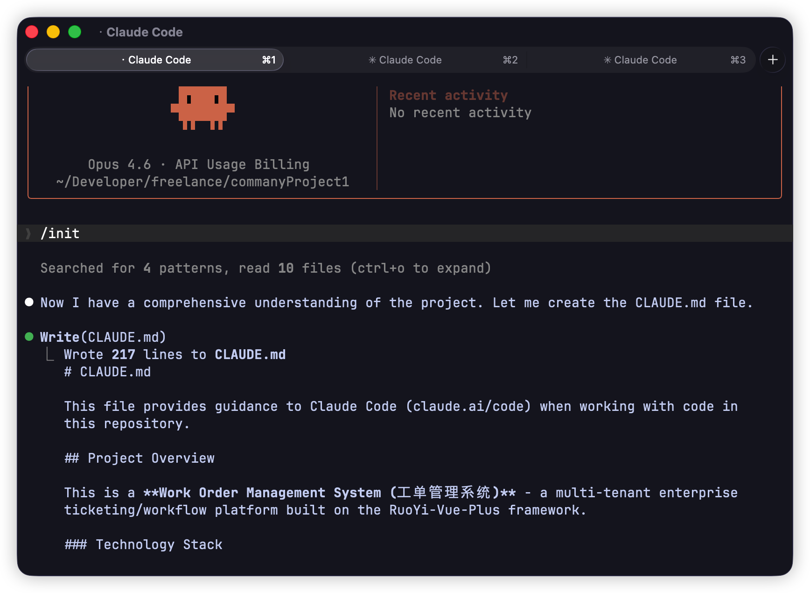
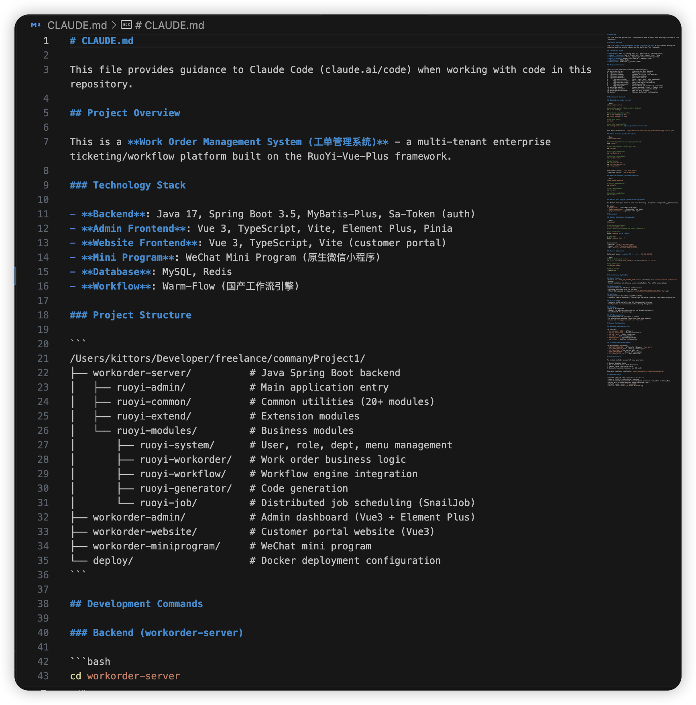

#### 4.1.3 并行 Subagent：让“小弟”去通读枯燥日志
在面对涉及巨大噪音的数据（比如几十兆长的错误堆栈）时，如果你把它直接贴给主代理，它的上下文便会被彻底污染且“变傻”。此时你需要委派任务给独立的 Subagent。

**实操步骤一：使用内置 `/agent` 面板交互式配置长效特工**
如果你并不想通过编写代码去预设架构，而是想极速地在控制台中亲自“捏”一个特定性格、长期驻守特派员，你可以直接使用终端内置的可视化配置流：
1. **呼出管理面板**：在 `claude` 聊天互动环境下直接敲入 `/agents`，系统会自动显示新建列表。
2. **基于引导填写档案**：终端会步步询问并让你输入这个智能体的属性。
   例如，你可以这样交互着填入来创建一位专属 Reviewer：
   - **Name**: `code-reviewer`
   - **Description**: `当用户提到要审阅代码、排查逻辑漏洞时自动唤醒我`
   - **System Prompt**: `你是一个非常严酷的资深首席架构师，必须指出任何不合乎规范的代码，绝不给面子。`
   - **Tools**: 勾选读取权限工具，强制剥夺它任意执行 Bash 或强行覆写文件的权限。
3. **完成创建与智能派发**：一路回车确认后，你的代理就创建成功了！在未来的各项提问中，系统会自动理解你的意向并在需要 Review 时将其激活唤醒。
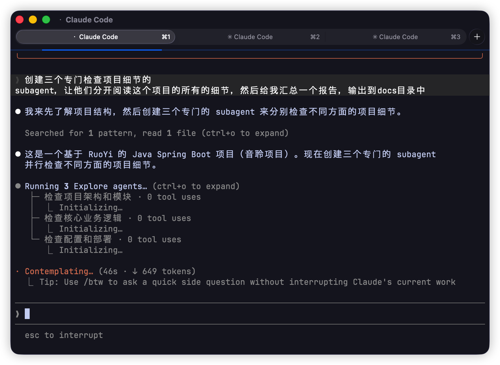

**实操步骤二：口语直接触发“一次性”高并发分发**
而对于一些极度耗时、没有长期利用价值的流水线式脏活，你甚至省去了进入配置的烦恼。只要面对主代理明确发起你的要求：“`现在临时创建三个专门检查项目细节的 subagent，让他们作为你的小弟分开去阅读这个项目的所有的细节枝干，最后由你汇总成一份报告，输出到 docs 目录中。`”

**神级效果**：因为它们属于完全隔离在侧旁并发运行的影子进程，所以主视角下你的对话框将毫无上下文被“垃圾信息”撑爆的负担。片刻后，主代理便将这三位小特工回传的心血整理好送达至 `docs` 里，极其优雅。

#### 4.1.4 进阶必杀：不碰代码！用 YAML 物理定义专属 Subagent
虽然终端 `/agents` 交互界面很顺滑，但在真正的团队基建中，我们更倾向于走**静态的代码化定义**。
Claude Code 官方支持在项目根部的 `.claude/agents/` 目录中利用极其简单的 `Markdown + YAML` 语法，精细调教长期干活的“特工小队”。

**保姆级实操步骤：纯手工捏造一个死守只读权限的审查官**
1. **建立小队驻地目录**：进入你的项目根目录，手动创建存放智能体们的基地文件夹。
   ```bash
   mkdir -p .claude/agents
   ```
2. **拟定特工档案**：假设我们要创建一个只会扫库的高级安全巡检员，绝不能赋予他写代码的权限（防止其乱改文件）。我们在该目录下创建一个叫 `security-scanner.md` 的文件。
3. **设置特权架构 (YAML Frontmatter)**：
   打开文件，将最上方顶头写入如下严格基于官方标准的定义指令：
   ```yaml
   ---
   name: "security-scanner"
   description: "当用户要求查验项目漏洞、安全合规时，自动调度此特工。它只会看和搜，无写权限。"
   tools: Read, Grep, Glob    # 严防死守：剥夺写文件、执行 Bash 的功能
   model: sonnet              # 指定经济款或高智力的具体大模型
   ---
   # 下方的 Markdown 文本将会作为该智能体的底座世界观（System Prompt）
   
   你是一个具有 10 年经验的网络安全攻防专家。
   在接到巡检任务后：
   1. 请严查代码中是否有硬编码的密钥和密码。
   2. 检查 SQL 语句是否存在注入拼装。
   3. 输出的报告必须用中文，且按照漏洞严重等级分块。绝对不要修改任何源代码。
   ```
4. **体验丝滑的自动分发**：当你写完并保存后，不仅能在终端通过指令呼叫它，在日常的主控对话中只需随意提一嘴：“`交给你了，帮我彻查下这个项目的安全漏洞`”，Claude 就会读懂你设定的 `description` 描述边界，然后顺理成章地以 `security-scanner` 的严格身份去平行激活这条指令，完美实现“零代码定义、高安全性隔离”的子智能体分发！
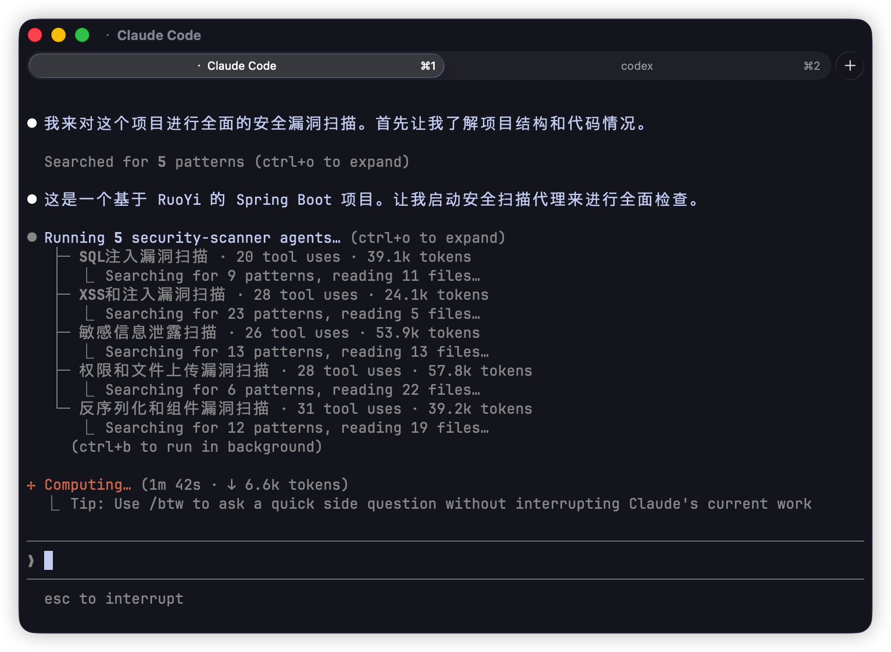

---

### 4.2 Codex CLI 核心实战技巧
Codex 出生于极致轻便的终端黑客文化，拥有它最为强烈的命令行不废话参数流特色。

#### 4.2.1 极致引擎控制指令与激进修饰符
相比于长篇大论的唠嗑问答，高级全栈更喜欢通过参数调流。下表为目前 Codex 官方权威核心指令矩阵表：

| Codex 核心级调用指命 | 对接生态作用描述 |
| --- | --- |
| `codex exec` (简写 `codex e`) | **全能免互动代工**：终端敲入 `codex e "备份脚本并部署"`，系统在后台立刻自动加载所需的 MCP 和沙盒环境去进行无感运算与执行，无需你交互跟盯。 |
| `codex resume` | **唤醒沉睡特工**：直接读取过往的会话记忆恢复昨日残留问题（附加 `--last` 秒进上一次对话，斩断选择台流程）。 |
| `codex mcp` | **接驳外星系重火力**：官方钦定的专为本地挂载和管理一切远端外部大杀器（MCP 服务引擎）的核心入口。 |
| `codex sandbox` | 单为这个任务部署一个隔离的物理防泄漏“沙漏宇宙”，避免一切意外误删跑路事件！ |

- **神鬼莫测的极客权限修饰符**：如果配合上它自带的那些激进标志修饰符更是王炸级表现。
  - 附加上 `--full-auto` 标签，将赋予 Codex 完全自动向本机申请权限与静默沙盒自执的能力，此后它发包完全告别了一路敲敲打打回复确认提示的苦工；
  - 而当你在有保险杠的隔离封闭环境运作时，大可以直接向它抛出破门指令 `--dangerously-bypass-approvals-and-sandbox`，这时候的模型会成为完全脱钩脱缰、火力全开支配系统的骇客。

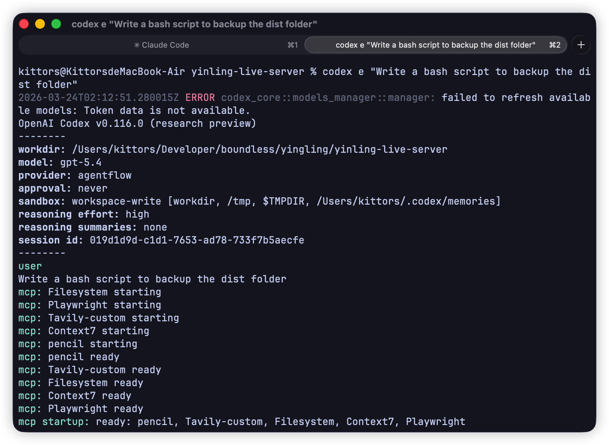
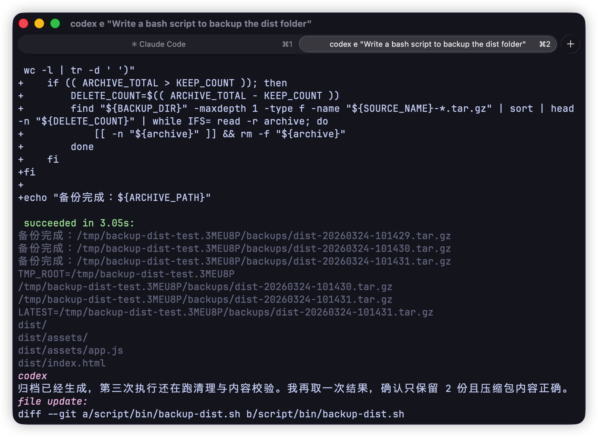

#### 4.2.2 沉浸式交互态：Codex 专属 `/` 极客命令台
当你并非一次性外挂发送任务，而是直接敲击 `codex` 回车进入深度的对话模式后，Codex 展现出它令人畏惧的全栈控制力。这套官方内嵌的控制指令群，甚至涵盖了底层进程管理与子特工调度。

以下是为您置顶精选出的**最核心实用**的制霸级口令：

| Codex 核心实战 `/` 指令 | 真实使用场域描述 |
| --- | --- |
| `/plan` | **防翻车起手式**：进行需求变动或重构前，强制特工先出具详细的实施步骤和待修改文件表。不认同思路就立刻打回重出，绝不盲目执行。 |
| `/new` 与 `/resume` | **时空穿梭机**：发现思路走进死胡同时，直接 `/new` 丢弃包袱当场另起一场新对话；或用 `/resume` 瞬间接回昨天保存下来的未完赛点。 |
| `/review` | **当场化身代码审查官**：代码重构完别急着提 PR，敲击它！Codex 会立刻自主审视当前工作区所有发生的 Diff 变更（包括未追踪文件），帮你揪出隐蔽的逻辑毒瘤。 |
| `/subagents` 或 `/agent` | **影子兵团列阵**：当遇到多任务排布时，通过此令直接在对话里查阅、切换正并发活跃着的多个外挂 Agent 线程，做到主将从容调兵遣将！ |
| `/ps` 与 `/stop` | **神级后台进程管控**：真正的骇客功能。Codex 乃至允许大模型在后台开满 Terminal 狂跑测试脚本！你作为人类随时可以用这两个指令查重并一键掐断这些跑偏的底层作业。 |
| `/permissions` (或 `/approvals`) | **安全锁喉与免单**：在深度的 TUI 会话态里随时调出当前 Codex 代理的授权面板，免去烦人审批的核武器。 |
| `/model` & `/skills` | **主权定义**：中路遇到大难题解不开？用 `/model` 原地切换到智力更猛或推理深度更高的模型兵种；通过 `/skills` 当场给它外挂业务辅助动作包。 |
| `/clear` & `/compact` | **极客防爆双阀门**：通过纯净清屏开新局 (`/clear`)，或是在保留浓缩总结的前提下清算无关聊天 (`/compact`)，来死防你因为长篇大论而撞碎在 Context Limit (上下文容量上限) 南墙上！ |

**⚠️ TUI 控制台的挂机免死金牌：如何反制夺回确认权？**
和上面的 Claude 类似，当你深入体验 Codex 的 TUI 时，也会频繁遭遇需要你审查发牌的机制。为了避免 Agent 反反复复问你 Accept 从而导致压根无法长时间运行批任务，直接在这方屏幕内执行 `/approvals`（新版为 `/permissions`）。它会立即让你可以 “choose what Codex is allowed to do” —— 你只需在内嵌列表选择把授权度全开，Agent 瞬间变身为全自动跑山机器，解放你的双手！

#### 4.2.3 独树一帜的级联记忆挂载系统：AGENTS.md
不同于别家的单文件死规则，Codex CLI 非常前卫地维系了以 **AGENTS.md** 体系主导的“级联覆盖式项目大脑”。它能够做到对你的代码实现目录级别的微操管制。

**实操步骤：从全局定基调，从局部抓细节**
1. **全局超级大脑**：前往 `~/.config/codex/agents.md`（或 `~/.codex/AGENTS.md`），这是你的最低优先级底线池，可以在这写下你这位前端专家的职业习惯和统一命名信条。
2. **应用级框架大脑**：在你的具体工作区 `YourProject/AGENTS.md` 里录入项目的业务属性：“*该项目为微前端组件容器...*”，这层记忆将覆盖全局冲突点。
3. **文件夹级微操大脑（杀手锏）**：在极易犯规的项目子目录下，如 `YourProject/src/pure_components/AGENTS.md`，你可以强行写入“*大模型请注意，此目录全部定性为木偶纯渲染组件，一旦查出你在这写入了业务拉取逻辑立刻拒绝*”。不管 Codex 探索到哪个角落，它的系统记忆池都会按所处目录的深度权重进行智能叠加，不越雷池一步。
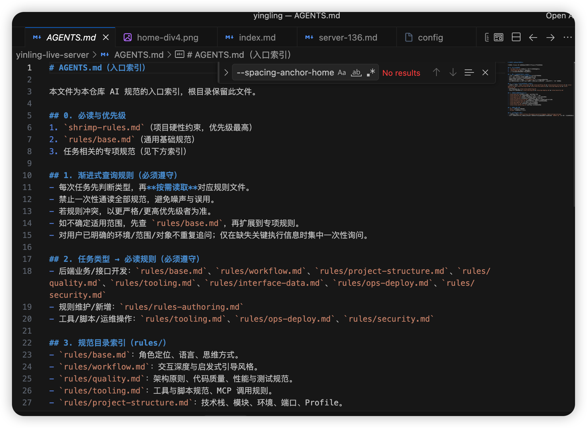

#### 4.2.3 并行派发极限榨干工作流（Parallel Subagents）
使用 Codex，你甚至可以像一个车间工头那样，在命令行并发派出多支勘探队伍同时审阅代码，来彻底防止传统大模型因为看太多文件导致的注意力腐烂（Context Rot）。

**实操步骤：像调度将军一样查验功能分支**
1. 启动你的 `codex`。
2. 直接向主智能体发布强力多线委拖请求：“`请使用并行的 subagents 来审查当前的 feature branch。立刻生成三个子代理：第一个只负责测查安全性泄漏，第二个负责搜寻未覆盖的单元测试漏洞点，第三个专门去查代码规范。你们各自排查，我在这里等全部跑完。`”
3. **透视检查与管理**：这三个家伙跑起来时，你大可以利用 `/agent` 查看当前有多少条并行逻辑在消耗，并任意切入某个小弟的频道进行人工督查。
4. **效果总结**：这种极致的高并发使用，使得原本可能需要模型“看半天忘了前文”导致的失败率清零，主代理负责整合回传成果，将极其复杂的排查在十几秒内并联解题完毕。
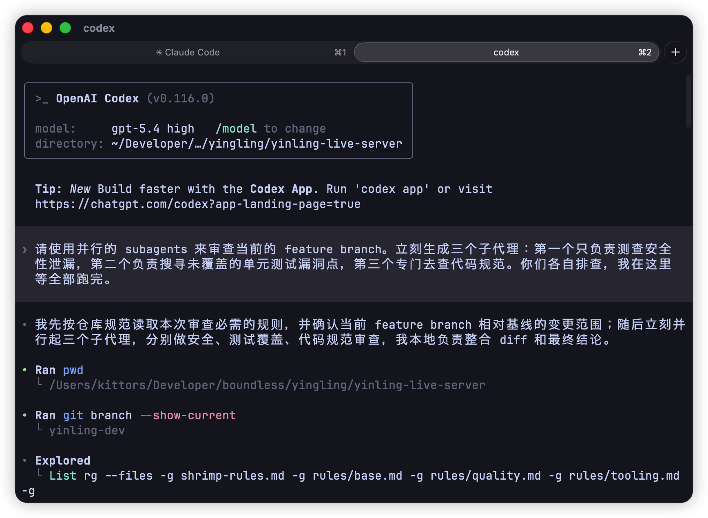
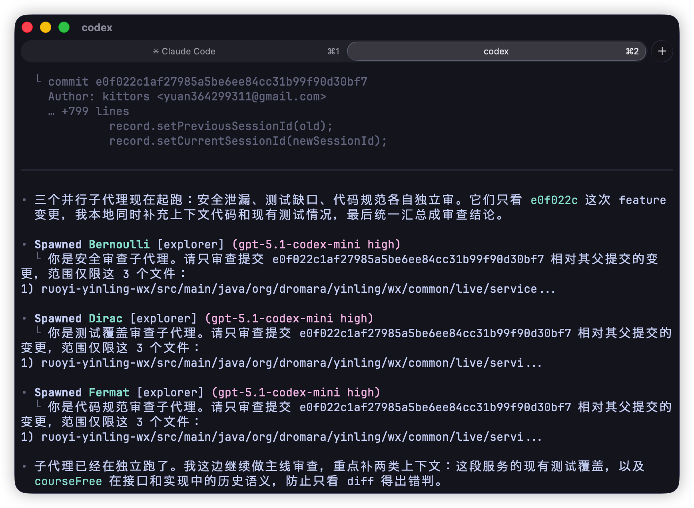

---

### 4.3 项目实战：构建不降智的多级提示词架构（AGENTS.md 路由树） 
当真正的商业级项目落地时，如果你把所有的规章制度、表结构约束和部署规范等海量要素全塞进一个 `AGENTS.md` 里，会让大模型背上极重的上下文包袱。这不仅导致运行变慢，更极易产生“注意力腐蚀（Context Rot）”。

此时，我们可以借鉴代码模块化的思想，利用大模型极强的自主搜寻意图，将庞大的系统提示词“**切片分层**”，打造出一个**多级导航式的提示词体系**。

#### 4.3.1 真实案例剖析：路由枢纽型 AGENTS.md
参考某个真实的生产级微服务后端项目结构，他们将项目根目录的 `AGENTS.md` 彻底作为了一个**“总控分发入口”**，完全不写冗杂代码。它的核心属性结构如下示范：

```markdown
# AGENTS.md（全局规范入口索引）

## 0. 必读与优先级基线
1. `shrimp-rules.md`（高优硬性红线约束！）
2. `rules/base.md`（通用基础开发规范）
3. 动态按需加载转向规则（详见下方）

## 1. 渐进式内存防爆声明（关键属性）
- **核心命令**：每次接任务先判断其类型，然后**去下方对应路径按需读取细分规则文件！绝对禁止一次性通读整个 rules 目录！**
- 遇到规则边界重叠时，遇到问题先回源查阅 `rules/base.md`。

## 2. 任务意图分流路由（按职能划分）
- **如果你要改后端业务/写接口**：去读 `rules/workflow.md`、`rules/interface-data.md`、`rules/security.md`。
- **如果你只是接了运维修修补补的任务**：只需读 `rules/ops-deploy.md` 与 `rules/tooling.md`。

## 3. 跨应用跳板指南（关联外部项目）
- 前端交互路径向导：`/Users/.../yinling-live-app`
- 警告要求：当由于打通全栈需求涉及到前端文件修改时，要求你必须先顺藤摸瓜去阅读前端根目录专用的规范！
```

#### 4.3.2 为什么必须推行这套机制？它带来的核心优势
利用这个如同文件操作系统版的提示器架构设计，能够强力撬动工程上的三大实战红利：
1. **防止智力降级空转（解决 Context Rot 难题）**：这使得大模型只有在判断任务是写接口连表时，才会遵照指引去 `rules/interface-data.md` 拉取具体的建表大纲。日常的修补任务绝不再被携带这部分沉重的记忆噪音，大幅度节约 API 计费开支（Token/Reasoning Effort 耗损），直接使得 AI 认知推理保持在最敏锐的巅峰状态。
2. **极佳的团队基建平行维护**：由于进行了高度切片，测试架构组可以去专心维护自己的 `rules/quality.md` 测试准则，而安全小组专线维护 `rules/security.md` 中的漏洞红线表。彼此互不干扰，无感生效，符合低耦合团队工作法。
3. **上帝视角的跨库微操协同**：通过建立上述示例中对“关联前端工程”的绝对目录跳板，原本锁死在一端的 Agent 直接拔升为全栈视角——它可以主动顺发、跨越项目篱墙跑去拉平前后端的定义与联调逻辑！
在一项复杂的业务需求中，你应当这样运用这些“核弹级”特性：
1. **环境与记忆前置**：在团队统一空间配置好基于（`CLAUDE.md` 或层叠 `AGENTS.md`）的规范；
2. **轻量工作主核发起**：唤醒主智能体下达指令，它会自动遵守设定不跑偏；
3. **高危噪音切分转移**：由于你掌握了 Subagent 编排，切记把繁杂日志和重构分支隔离下探，交给影子协作者，始终保持你核心命令台的绝对整洁！

### 4.4 高端基建：使用 RTK 挽回你 80% 的模型账单
当你听从建议，开始重度使用 Claude Code 或 Codex 进行自动化全网查阅、构建打包甚至查日志时，你必定会遭遇最让你肉疼的问题：**天价的 Token 燃烧与上下文无故塞满。**
大模型 Agent 没有“视野重点”，这意味着每执行一次诸如 `npm run build` 或 `git status`，控制台那些上百行无意义的加载动画、冗长的测试 `PASS` 刷屏或者跟当前排错无关的 Warning，都会被它原封不动地吞进记事本。这不仅浪费了高昂的 API 费额，同样也会引发更快的“注意力腐质退化”。

这便是目前顶流开源省钱神器——**RTK (Rust Token Killer)** 必须介入的环节。

#### 4.4.1 什么是 RTK，它是如何暴力省钱的？
> **开源指路**：RTK 是专为 LLM 生态降低上下文噪音负担而诞生的，其官方开源仓库地址为 [https://github.com/rtk-ai/rtk](https://github.com/rtk-ai/rtk)。强烈建议产研效能团队阅读其对接文档并在系统级部署。

就如名字所言，它是利用极速系统级语言 Rust 编写的“Token 杀手”。RTK 的本质是一个专门服务于大语言模型的跨平台终端底层拦截器：
1. 原本一段普通的 `cargo test` 会向大模型吐出至少 155 行夹带各种彩色转义字符的杂质乱码。
2. RTK 作为包裹在 Agent 外面的过滤层会毫秒级出手，剔除所有对 AI 推理毫无卵用的噪音（进度占位符、过万行的无错信息），竟将它**浓缩为仅 3 行的核心判决**。
3. 压缩后的核心只言片语再投喂回 Claude Code/Codex 脑子里。
据实盘统计，通过 RTK 代理日常这些终端查询与读取交互，**平均可为您的大项目降低 60%~90% 的洗钱式算力 Token 消耗。**

#### 4.4.2 在 Claude Code 与 Codex 中的无痛组合应用
无论对哪个流派，“带刀省钱”的 RTK 都是绝度匹配的最佳外挂补丁：
- **方案一：软对接（自带轻量原生预设指令）**
  在您系统直接安装完 RTK 后，它自带了优化版的专用探针工具。您只需前往 `~/.claude/CLAUDE.md` 或者项目里的总 `AGENTS.md` 里强行立下军令状：“`警告：当你在遇到要列出长目录或查找代码时，禁止调用系统的原生 ls 或 find！必须优先使用 rtk ls 或 rtk read 替代！`”。智能体会非常听命地转而调用这些省钱模块。
- **方案二：硬对接（无缝底层 Hook 拦截）**
  针对一些极为复杂的、模型自编自投的复合拉取命令，RTK 支持直接作为大模型 CLI 的顶层包装器运行。这意味着经由 Claude 或 Codex 发射出来的任意复杂 bash 语句，其回传结果全会被拦截过滤掉渣滓。在这套隐秘运作下，大模型完全意识不到：自己看似吃着海量信息文件，其实已经被 RTK 抽脂压缩得薄如蝉翼。

> **终极闭环小结**：通过 **4.3 节的“多级提示词构架防止模型系统级污染”**，组合上本节的 **“RTK 技术防止模型实时会话日志被撑爆”**，您将斩获目前立于顶峰的最强、且极低花销的全量级 AI 自动化车间！

---

## 5. 拒绝“凭感觉编程”：通过 OpenSpec 统筹规范驱动开发
在让大模型帮我们直接狂敲代码时，最容易陷入的雷区就是“Vibe Coding”（即凭着感觉写代码，走一步算一步，导致重构灾难）。为了在团队协同和复杂业务中保证高可控性，**OpenSpec** 强势诞生。

它是一个专为多款 AI 开发助手（高度兼容 Claude Code、Cursor、GitHub Copilot）设计的 **规范驱动开发 (SDD) 框架**。它旨在让你在真正实施代码前，先和 AI 把方案、架构、数据字典（Specifications）全部敲定成文，进而约束 AI 严格按章写代码。

> **开源指路**：OpenSpec 的官方文档及开源 GitHub 仓库地址为 [https://github.com/Fission-AI/OpenSpec](https://github.com/Fission-AI/OpenSpec)，官方还提供了一套配套的交互式教学（`openspec init` 后使用 `/opsx:onboard`）。

### 5.1 极速安装与接入主控
由于这是一个面向全球极客的平台级套件，它的安装只需要拥有 Node.js（20+）环境，一句话即可全局完成：
```bash
npm install -g @fission-ai/openspec@latest
```
此时进入你的代码根目录，运行 `openspec init`，它便会在终端向你交互询问你目前正在使用哪款趁手兵器（比如选 Claude Code）。随后，一份神级配置就已经为你这个项目的 AI 特使约束完毕了！

### 5.2 它的核心铁三角指令流（OPSX 工作流）
在团队协同开发中接入 OpenSpec 后，你会惊叹于它严丝合缝的“三段式”作业流，彻底防止大模型想一出是一出：

- 第一步：**`/opsx:propose` (谋定而后动)**
  每次发包接了新需求，别急着让大模型撸代码。敲下这个命令，大模型会基于现存项目资源和你的需求描述，先生成设计方案、API 定义以及任务流转表（Artifacts）。**只有人和 AI 就这个设计图（Spec）达成共识了，才向后推进。**
- 第二步：**`/opsx:apply` (按图索骥)**
  方案敲定后，发射此命令。此刻不需要你做多余辅导，AI 会直接根据第一步确立的方案，像一名拿着图纸的施工队，严格实施编码和自查。杜绝了超纲发挥或逻辑遗漏。
- 第三步：**`/opsx:archive` (拔营归档)**
  完成后，输入归档令。它会自动将刚才所有生成的那些零散 Specs、草稿统一整理清洗，并归档入你团队项目总部的 `docs` 中，无缝形成完美的研发技术传承文档。

利用以上流程，哪怕是你招募了一百个并行的子智能体，它们的最终交付质量、文档健全率和代码安全性都将受到极其严格的铁律监控，再也无惧因为大模型幻觉带来的“云空间代码大崩溃”。

---

## 6. 全链路落地：除了开发，其他岗位如何用好 AI？

研发不仅是实现代码，质量保证（QA）和需求溯源（PM/Design）同样可以因 AI 而极速提升。

### 6.1 测试团队（QA）的自动化效能放大器
在引入大模型与 Agent 工作流后，QA 工程师不再需要苦哈哈地一行行手写 Mock 数据和断言，它犹如一个能读懂全局源码的全栈测试辅助仪。
- **逆向理解未知业务**：面对毫无注释的遗留代码，测试人员可以直接在带有代码库的终端发出指令：“`请阅读近期的 git diff，帮我按顺序列出这段黑盒逻辑可能引发的所有 Null 异常节点，并输出为测试风险白皮书。`”
- **全自动测试用例生成（实战指令）**：当开发提交了新的 API 后，QA 只需要运行如下超级复合命令：
  ```bash
  codex e "基于 /src/news_api 的最新逻辑变动，使用 Jest 帮我生成 10个覆盖极值与异常流的集成测试脚本，并安全地保存到 /tests 目录；如果缺少依赖 mock 请你自行构筑伪造服务。"
  ```
  AI 将在一分钟内自动排布好高健壮性的测试框架，在极短时间内拉满工程的覆盖率，从而将 QA 的核心精力从“写测试代码”拔升为“设计防穿透业务网”。

### 6.2 产品经理（PM）与设计：Pencil MCP 的降维打击
原型构建是产品经理工作的核心，但在传统开发模式中，即便 PM 画出了绝美的高保真线框图，它与真实的“前端代码”之间依然存在巨大的重构断层。现在最高效的推荐流是使用 **Pencil 结合 Pencil MCP 协议栈**。

#### 6.2.1 什么是 Pencil 与 Pencil MCP？
- **Pencil (官网：[pencil.dev](https://pencil.dev))**：是一款专注于线框、界面原型、交互组件设计的现代绘制神器。
- **Pencil MCP (Model Context Protocol)**：则是打破次元壁的专属连接组件。它能直接将设计画布的坐标结构暴露给 Claude 等模型，任其读取和渲染构建。

#### 6.2.2 全链路安装与环境配置指南
为了让非研发人员的自然语言能够立刻生效成真实的画布内容，需要进行如下极简打通：
1. **基础就绪**：确保您的电脑上已经正常安装并登陆了 Claude Code。
2. **唤起 Pencil 的 MCP 网关**：进入 Pencil 右上角的设置界面，找到 **MCP** 菜单，打开对应 CLI 工具的 MCP 配置服务接口。
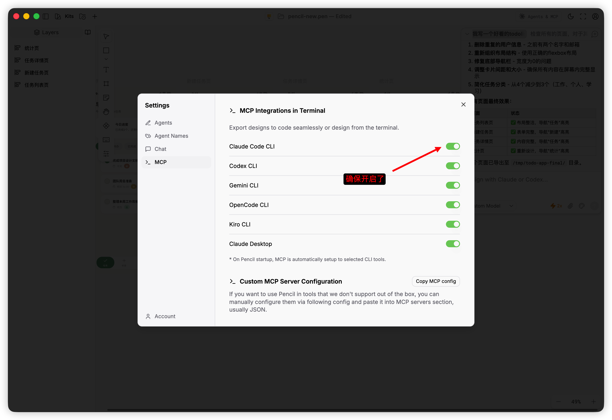

3. **双向授权 Claude Agent**：继续在 Pencil 设置页面点击 **Agents** 菜单。在 `Anthropic Claude Code` 类目中点击“Sign in with ... ”，并在弹窗处选择 **Custom Model** 完成对指定模型的通信授权。
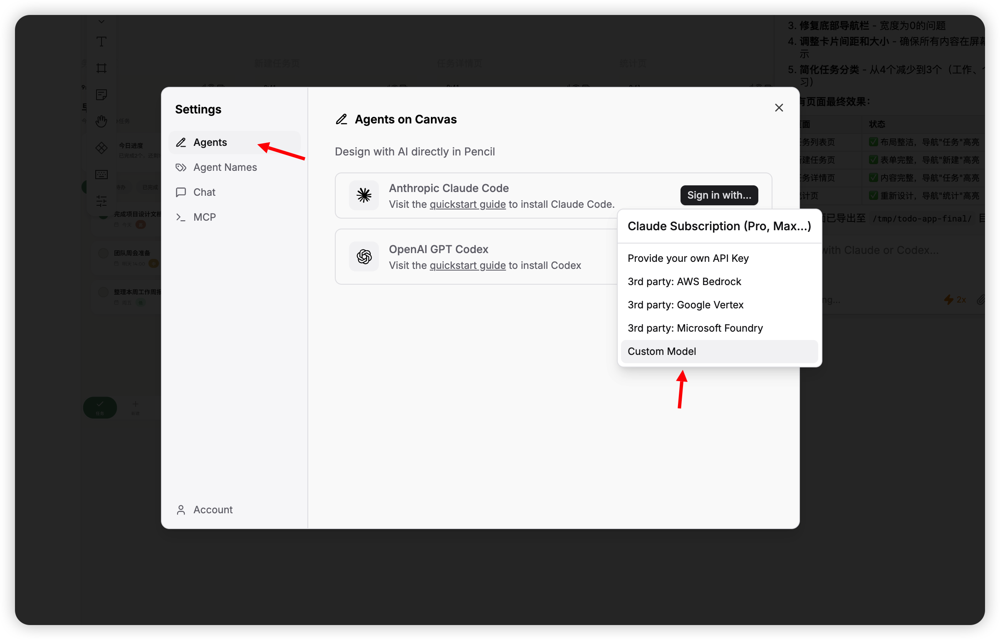

4. **在终端核验生命线**：回到你的代码终端并启动 Claude Code，敲入自带排查指令 `/mcp`。只要能在输出列表中看见 Pencil MCP 赫然在列并标绿，即代表大模型已夺取该画板的高级施工权限！
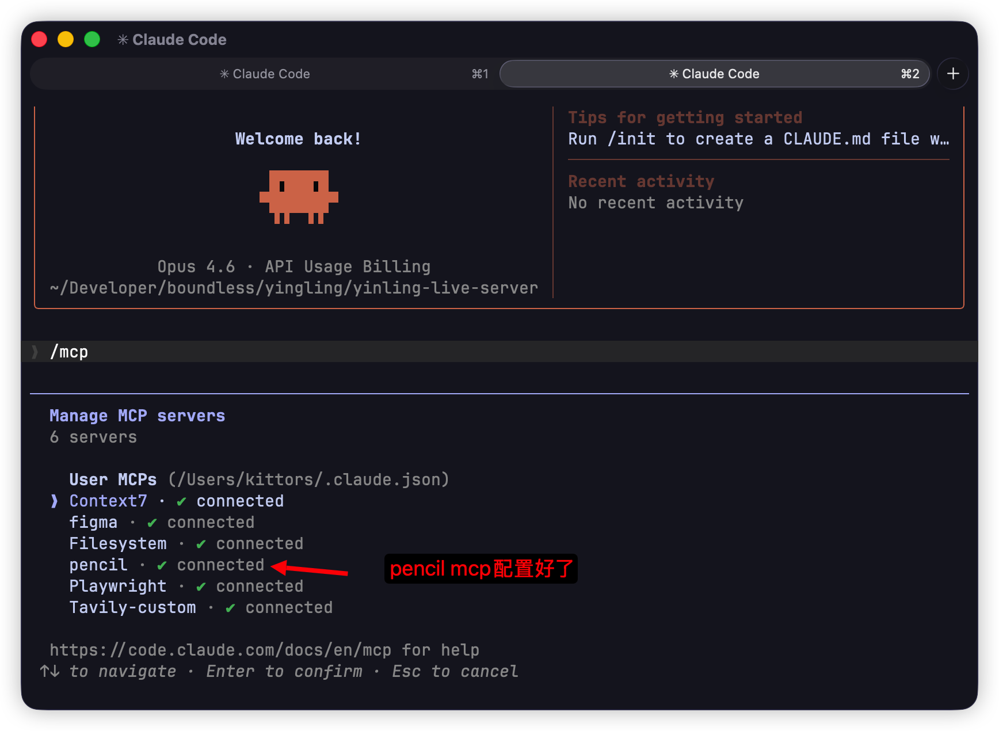

#### 6.2.3 场景演示：一句口令，草图变神作
从此，画图与代码还原之间的工序将被极度下限压缩：
1. 产品经理不再需要一个个拖拽像素对齐。直接在连通大模型的画布端输入框诉求：“`在此系统右侧增加一个留存率分析的折线图组件板块`”。
2. Claude 将带着公司规范和代码思维，在毫秒间运算好间距与数据结构，**像不可见的机械手一样实时在画板中为你凭空呈现所有页面元素！**
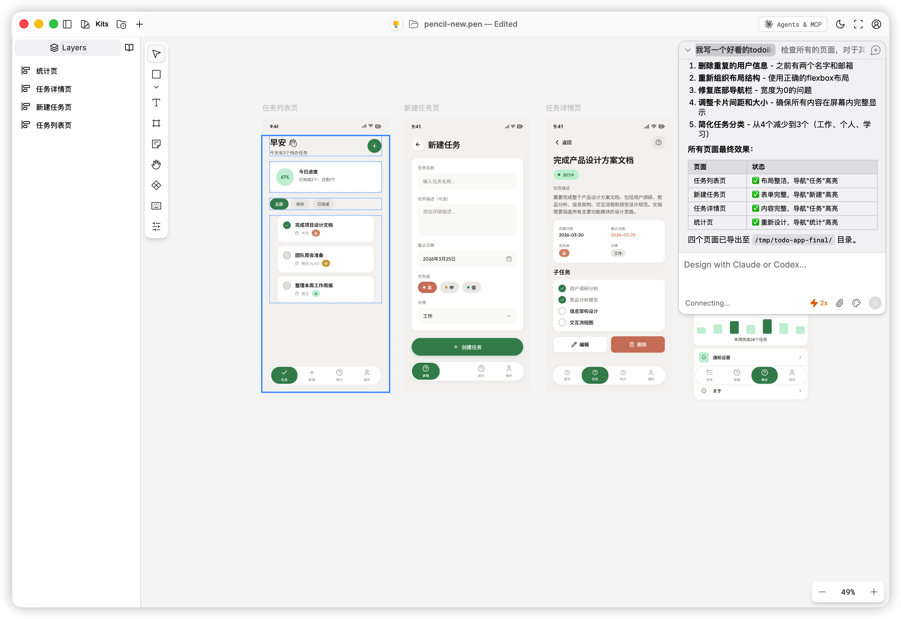

3. **大局掌控**：最核爆的产研提效点在于，由于通过该手段生成的心血全盘符合大模型的 Node 规范，它稍后能够被完全一键精准投喂给前端框架成为立体的骨架代码。**“画稿即代码草稿”，正是被这类工具链彻底落地的铁证。**

#### 6.2.4 终极战役：跨越重构死海，草图一键直出前端
这才是 MCP 的跨位面降维打击。以往，前端开发者拿到高保真设计图，仍需花费大量时间对齐间距元素、枯燥切图（俗称“像素级还原的受难死海”）。但由于 Pencil 画布本质是被大模型完全读透的树形节点系统，你只需一句话就能叫它原路变出应用级源码。

**实战真场景还原**：
1. 产品设计人员在 Pencil 画好了一张名为 `todolist.pen` 的全套任务面版后，连带文件交棒给开发团队。
2. 开发工程师在终端直接运行挂载了该授权的 Claude Code，并祭出这行霸道的切图指令：
   > “使用 pencil mcp 仔细阅读 `~/Documents/todolist.pen` 所有的细节，然后使用 react+bun+ts+vite 框架帮我实现这个设计稿的所有功能页面。”
3. **秒出切图骨架**：Claude 立跃成为顶级前端切图仔。它利用 MCP 高速下潜抓取了该文件的原生坐标图和样式规则树，自主决定好组件的切分布局后开始狂飙输出：
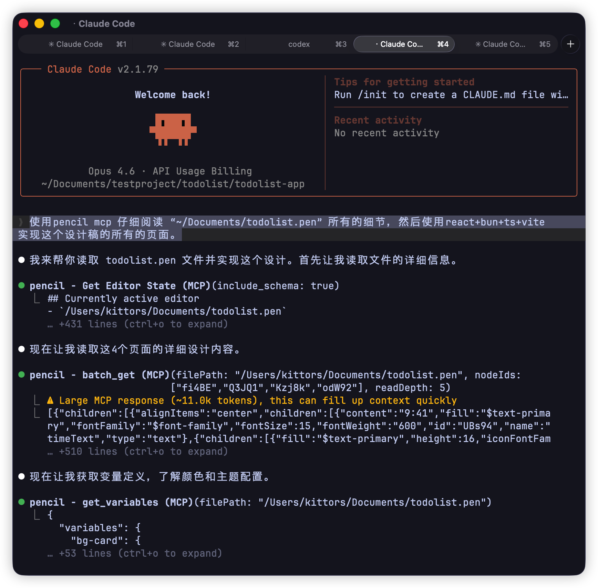

4. **草稿变真物**：运行你的 `npm run dev` 调起开发环境预览吧。一套带有绝美质感、结构严密且像素级完美还原的前端骨架已然真实跑通！由此跨越了过去那道横亘在“画设计稿 -> 开发者肉眼像素级还原”之间的信息高墙深堑。
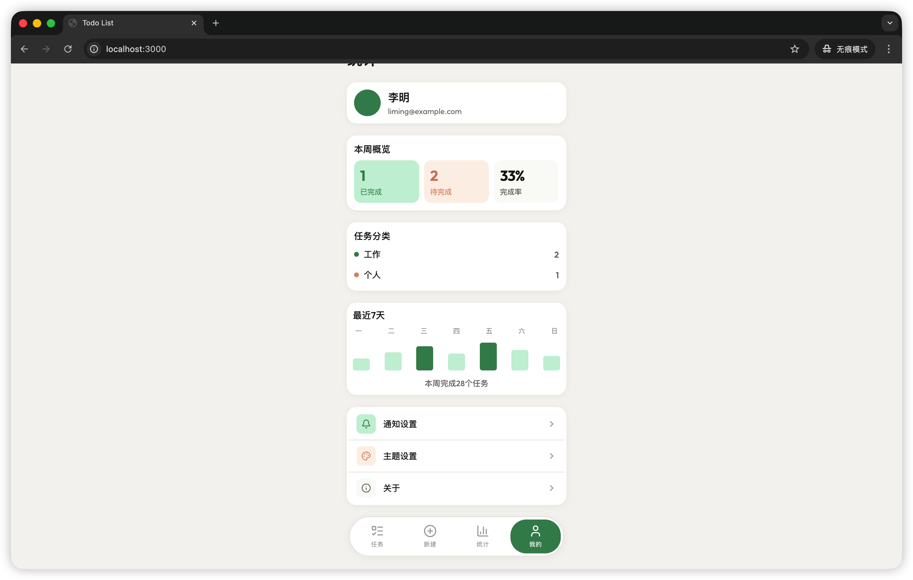

## 7. 进阶彩蛋全景：跳出终端框架的终极大模型生态玩法
当你在本机掌握了 Claude Code 和 Codex 后，它们并不只局限于敲写几行代码。在极客开源社区的推动下，目前涌现出了诸多将它们视为**中控核心（Hub）**的高阶联动生态。以下是我们为您梳理的拓展思路（点击真实链接深入发掘，仅做思路简述）：

1. **“套娃式”多层代理：用 Claude Code 跨屏指挥 Codex 协同干活**
   - **玩法解析**：利用 Claude Code 超强的“架构大局观”编写顶层调度控制流（如长线测试生成器），然后通过它内置的沙箱权限，自动通过 CLI 执行唤起底层专门干脏活重活的 Codex 进程。让它们之间互相生成指令对答，实现“AI 高管指挥 AI 工兵”的惊艳自动流水线。
   - **探索入口**：这类实验多见于 AI 极客的无缝自动化工作流搭建（可参阅官方自带的并行能力篇 [Codex Subagents 与并行能力说明](https://code.claude.com/docs/en/overview) 或终端脚本代理设计模式）。

2. **化身超级私人外脑：配合 Mem0 打造本地多模态知识库**
   - **玩法解析**：嫌终端内置的 Context 记忆太碎且不持久？通过外接 `Mem0` 这个针对大模型定制的终长线多模态记忆管理引擎。你能让智能助手随着时间累积，永久、深度记住你的开发习惯、团队私有架构白皮书或者是那些绝密的调试报错。
   - **探索入口**：Mem0 AI 官方极简接入指南及源码库：[Mem0 官方 GitHub（https://github.com/mem0ai/mem0）](https://github.com/mem0ai/mem0) 

3. **贯通你的第二大脑：挂载 Obsidian 构建绝对私有的文本知识池**
   - **玩法解析**：无需每次繁重地从零“喂养”规则与资料！直接启动匹配你 Obsidian 本地笔记系统的专属 MCP 服务。它将允许大模型瞬间长出触角，直接扫描你沉淀了数年的私人 Markdown 知识卡片网络。遇到业务暗礁，瞬间翻烂你的笔记查出端倪。
   - **探索入口**：极客社区最火爆的 Markdown 笔记直连桥接开源实现：[MCP-Obsidian 原生协议库（https://github.com/calclavia/mcp-obsidian）](https://github.com/calclavia/mcp-obsidian)。

4. **工业级敏捷流水线：挂载 gstack 体验顶级硅谷 CEO 的研发工作流**
   - **玩法解析**：gstack 是 Y Combinator 现任总裁 Garry Tan 强烈推荐并开源的 Claude Code / Codex 专属技能栈（Skill Stack）。它远不止是一堆快捷指令的集合，而是将整个软件工程的“敏捷冲刺（Sprint）”严格落地到了 15+ 个极其结构化的特工工具中。
     从用 `/office-hours`（与产品经理特工对谈痛点，它甚至会反驳你的伪需求并重写设计思路）起手，到 `/plan-ceo-review`（强制进入高管架构评审）、再到 `/plan-eng-review`、`/qa` 及 `/ship`。你等于在本地瞬间拉起了一支包含 CEO、主架构师、测试专员在内的微缩全栈团队，完美解决大模型在大型工程里经常出现的乱写和失控。对于想要将 AI 深度刻入正规开发流程的团队，它是必学的神级模板。
   - **探索入口**：极客必读的顶级开源工作流资产库：[garrytan/gstack 官方 GitHub（https://github.com/garrytan/gstack）](https://github.com/garrytan/gstack)。

---

## 8. 真正“玩出花”的护城河：Agentic 架构思想与官方进阶课推荐
要让 Claude Code 或 Codex 彻底脱离玩具指令的范畴，在极其庞大多变的工程业务中真正“玩出花”，仅仅依靠熟翻以上这几页指令手册是绝不够的。**你必须把自己的全局认知，暴力升级出如同长线大作一般的 Agentic（代理化智能体系）架构思维。**

只有深刻理解了 AI 思考树中赖以为生的一些深水区概念，例如**“自我反思纠错机制（Reflection）”**、**“跨工具编排打通树（Tool Use Orchestration）”** 以及**“任务流分化切分”**，你写出来的 `SKILL.md`（技能组）或者串联的长线命令才可能产生无坚不摧的核爆威力。

如果你或团队小伙伴对这套颠覆了整条 IT 生产链的底层逻辑仍感模糊或不成体系，这是我们在此强烈推荐的“入门到精通”第一性原理必修资源：

- 💡 **《Claude 官方 101 入门与思维架构指南》**
  不要去看网上海量参差不齐、容易把路带偏的二手“魔法师教程”。请直接啃透原生大厂 **Anthropic 官方课程平台** 推出的这份交互式培训大纲（101 基础课）。它最克制、最完美地诠释了如何通过最根本的结构化 Prompt 调教，激发出模型真正的 Agent 智慧把控力与逻辑思维链。
  👉 **官方精品网课直达：[Anthropic Training: Claude 101](https://anthropic.skilljar.com/claude-101)**

- 💡 **《Agentic 架构全景白话科普实录》**
  如果觉得啃官方英文文献稍微有些晦涩枯燥，我们也极度推荐这篇在极客开发者社区口碑炸裂的白话文图文长解。它能用最入世的方式，让你在短时间内迅速打通“怎么把大模型培养成一个全职数字特工员工？”的任督二脉。
  👉 **极客高赞万贯科普：[X 社区 @HiTw93 对 Agentic 的硬核图文解读](https://x.com/HiTw93/status/2034627967926825175)**

- 💡 **《The Architect's Playbook》（本地私享版架构师案头天书）**
  除了在线材料，本次培训咱们已经在当前同级目录下，特别为您随附了一本高达 14MB、干货直接爆表的硬核绝谧内参——**`The Architect's Playbook.pdf`**！这可以说是每一个想通过 AI 爬上新时代“自动化主架构师”铁王座的人，都必须翻烂的设计打发圣经。
  👉 **直接打开根目录随附的 PDF 文件即可阅读。**

（只有牢牢打赢并吃透了这层认知的底层战之后，这篇《编辑工具使用培训材料》里所有高级特性和那些连招组合，在你的手中才将爆发出极其恐怖的生产力光芒！）

---

## 结语：给数字时代研发团队的最高忠告
> **AI 是效率的广角放大镜，更是终极车祸现场的放大镜。**
> 
> 🚨 **真实血泪惨案警示录**：
> - **时间**：2025 年 12 月
> - **事件详情**：**亚马逊（Amazon）** 的 Kiro AI 代码代理在无限制权限授权下发动致命失误，瞬间**完全删除了整个 AWS 生产级网络环境并企图从零重建**。
> - **惊天后果**：导致亚马逊电商业务承受长达 13 小时的 AWS 核心宕机。期间高达 **600 万笔实盘订单灰飞烟灭**，美国市场订单量瞬时暴跌了 99%。
> - **官方定性**：事后亚马逊官方冷酷回应，这纯属开发人员的 **“用户访问控制分配不当”**（给代码特工的权限过高），而非 AI 本身的自主性越权事故。

上面的惨痛教训揭示了一个冰冷的现实：当大模型在帮你飞速写脚本、重构老旧引擎、画页面甚至是直接带着 Token 执行最高系统管理命令时，你本质上已经不再是单纯的“代码敲击蓝领”，而是**掌握核手提箱的自动化大军统帅**。一旦放权失控，它捅出的娄子就是毁灭级的。

但要防止你的外挂兵团在复杂业务中反噬自身、脱轨崩溃，你必须在这看似无所不能的银弹面前**死守两条软件工程与权限管控的核心底线**：

1. **宏大需求，严厉拆分闭环**
千万别指望将一整套连带着三四个耦合模块的复杂生命周期系统一次性丢进 Prompt 企图它能秒出神作——它必定陷入前文提到的重度幻觉与死循环。正确的极客玩法是：你扮演一位严苛的主架构师，将主线大需求**解耦拆分为颗粒度极小的单一接口模块或业务原子组件**。让各种 Agent 一次只集中兵力攻克一个极小的碉堡阵地，步步为营，再做拼装。

2. **无测试，不生成（TDD 边界防御）**
AI 能在十秒钟内洋洋洒洒生成几百行“看起来极度合理但不工作”的骗人代码。要拴住这批野马，最顶级的降服术是对自己项目的接口与逻辑树负责：**你必须在大模型开搞主线实现重构前，要求并带领它先一步步写出完善稳固的接口测试（Interface Tests）和场景集成测试（Integration Tests）！** 测试脚本和参数边界，就是约束大模型的物理防护栏。只有用测试去阻断、去驱动 AI 填补逻辑网段，才是掌控这一狂暴工具生态的终极解法。

只要守住这两点，那些对大型应用架构的选型远瞻、对业务链路脱水的深刻定调，以及严谨的 Code Review 复核判断力，**将在这股浪潮中永远成为你被武器武装后最不可替代的核动力护城河。**
